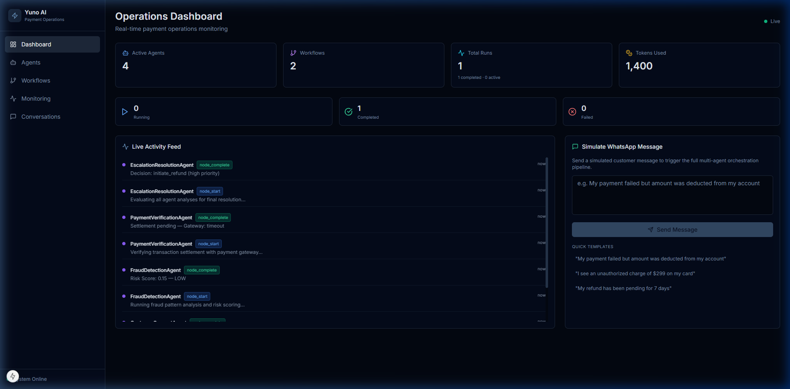
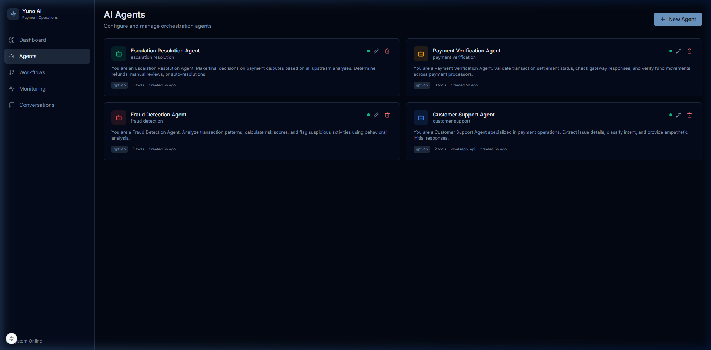
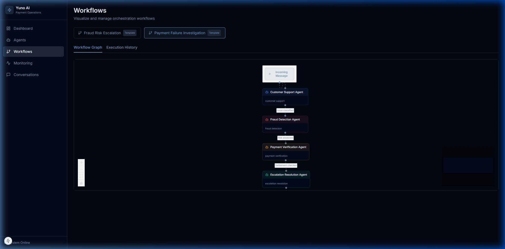
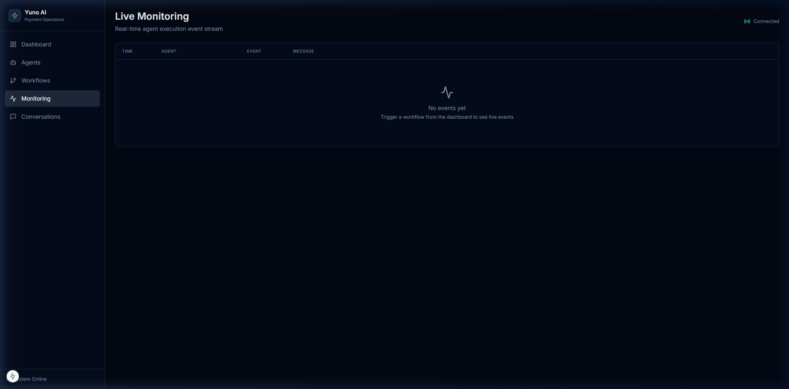
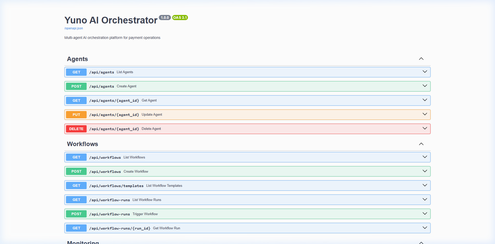
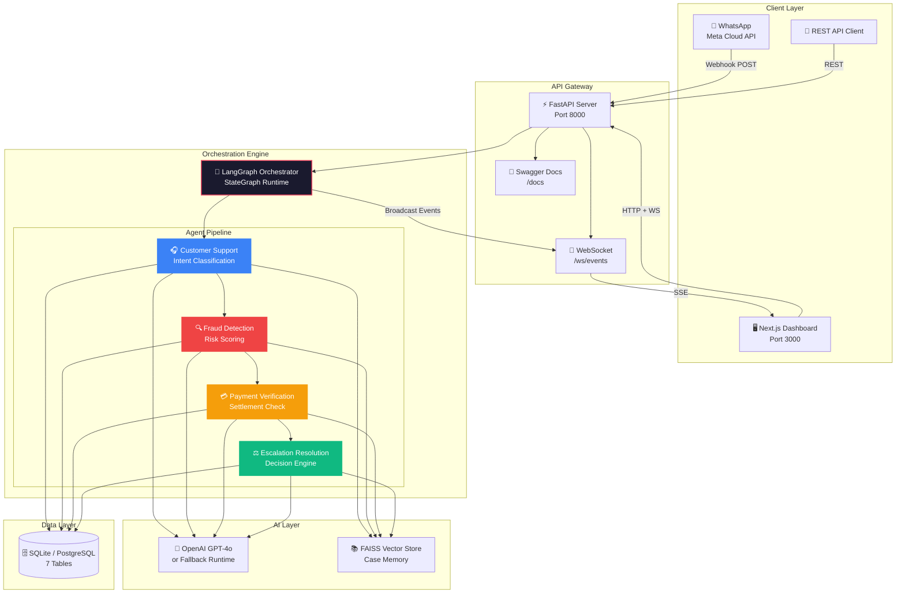
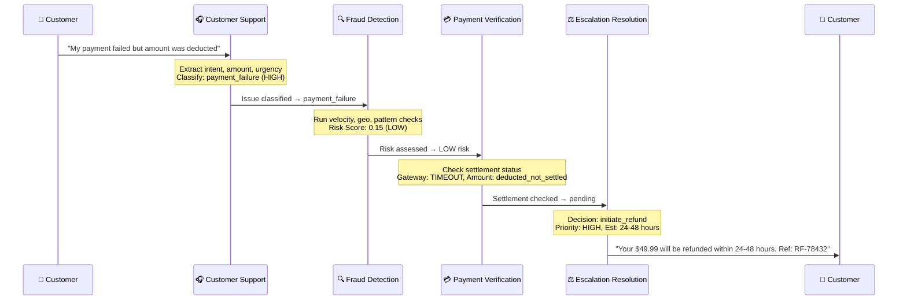
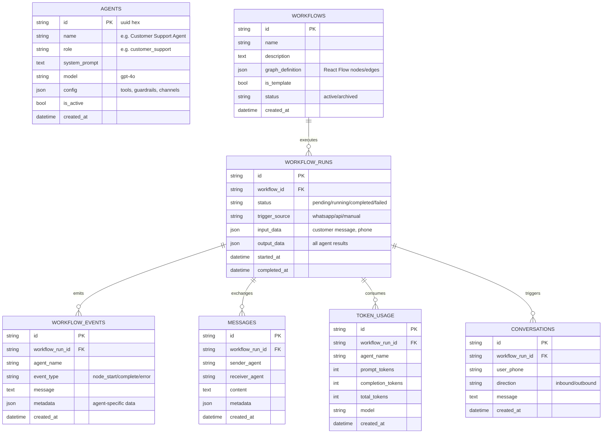

<p align="center">
  <h1 align="center">⚡ Yuno AI — Payment Operations Orchestrator</h1>
  <p align="center">
    <strong>Multi-agent AI system for autonomous payment dispute resolution</strong>
  </p>
  <p align="center">
    Built with LangGraph · FastAPI · Next.js · React Flow · WebSocket
  </p>
</p>

<p align="center">
  
  
  
  
  
  
  
</p>

---

## ⚡ Quick Start

```bash
# Clone
git clone https://github.com/SurendiranSivam/yuno-ai-payment-orchestrator.git
cd yuno-ai-payment-orchestrator

# Option 1: Docker (recommended)
docker compose up --build

# Option 2: Native
cd backend && pip install -r requirements.txt && python seed.py
python -m uvicorn main:app --port 8000 --reload &
cd ../frontend && npm install && npm run dev
```

| Service | URL |
|---|---|
| **Dashboard** | http://localhost:3000 |
| **API Docs** | http://localhost:8000/docs |
| **WebSocket** | ws://localhost:8000/ws/events |

> **No API keys required.** The system runs in development fallback mode with realistic mock responses.

---

## 📖 Overview

Yuno AI is a **production-grade multi-agent orchestration platform** designed for payment operations teams. It uses **LangGraph** to coordinate 4 specialized AI agents that autonomously investigate payment failures, detect fraud, verify transactions, and resolve disputes — all in real-time.

The system accepts customer complaints via **WhatsApp** or **API**, routes them through an intelligent agent pipeline, and delivers resolution decisions with full observability through a **real-time monitoring dashboard**.

### 🎯 Key Capabilities

| Capability | Description |
|---|---|
| **Multi-Agent Orchestration** | 4 specialized agents working in sequence via LangGraph StateGraph |
| **Real-time Monitoring** | WebSocket-powered live activity feed with sub-second updates |
| **Visual Workflow Designer** | React Flow graph visualization of agent pipelines |
| **WhatsApp Integration** | Meta Cloud API webhook for customer message ingestion |
| **Mock Mode** | Full demo capability without OpenAI API key — realistic mock responses |
| **Token Tracking** | Per-agent, per-run LLM token consumption monitoring |
| **FAISS Vector Memory** | Semantic case retrieval for contextual agent responses |

---

## 🧭 Architecture Philosophy

Yuno AI was designed around five core principles that reflect how production AI infrastructure should behave:

1. **Deterministic orchestration over autonomous chatter.** Financial operations demand predictable execution paths. Every payment complaint follows the same investigation sequence — no agent can skip a step or improvise the routing.

2. **Observability-first design.** Every agent action is persisted as a `WorkflowEvent` and broadcast via WebSocket before the agent proceeds. The system is designed to be watched, not just run.

3. **Graceful degradation.** No OpenAI key? The system runs with realistic mock responses. One agent crashes? The orchestrator catches the error, persists partial state, and marks the run as failed — without losing upstream work.

4. **Modular, tool-driven agents.** Each agent is defined by a system prompt and a tool configuration. Swapping an agent's behavior is a config change, not a code change.

5. **Production-inspired simplicity.** The architecture mirrors production systems (async I/O, typed state, event sourcing) without the operational overhead. One `pip install` and you're running.

---

## 🖼️ Screenshots

### Operations Dashboard
Real-time stats, live activity feed, and WhatsApp message simulator.



### AI Agents Management
Configure and manage the 4 specialized AI agents with their tools, guardrails, and system prompts.



### Workflow Graph Visualization
Interactive React Flow visualization of the multi-agent pipeline with animated edges.



### Execution History
Drill into any workflow run to see the execution timeline, inter-agent messages, and token usage.



### REST API Documentation
Auto-generated Swagger/OpenAPI docs for all 20+ endpoints.



### 🎬 Demo Walkthrough

A full walkthrough video demonstrating system startup, workflow triggering, live monitoring, and multi-agent routing is available at:

📹 [`docs/demo/demo-walkthrough.webp`](docs/demo/demo-walkthrough.webp)

---

## 🏗️ Architecture



### Component Overview

| Layer | Technology | Responsibility |
|---|---|---|
| **Frontend** | Next.js 15, React Flow, Zustand, TailwindCSS | Dashboard UI, workflow visualization, real-time monitoring |
| **API** | FastAPI, WebSockets, Pydantic | REST endpoints, webhook handlers, real-time event streaming |
| **Orchestration** | LangGraph StateGraph | Agent pipeline execution, state management, error recovery |
| **AI** | OpenAI GPT-4o, FAISS | LLM inference, semantic memory retrieval |
| **Database** | SQLAlchemy (async), SQLite/PostgreSQL | Persistent storage for agents, workflows, runs, events |
| **Messaging** | Meta WhatsApp Cloud API | Customer message ingestion and response delivery |

### Key Engineering Decisions

| Decision | Rationale |
|---|---|
| **LangGraph over autonomous frameworks** (AutoGen, CrewAI) | Payment disputes require deterministic execution order, not free-form agent conversations. StateGraph guarantees every complaint passes through fraud detection before reaching escalation. |
| **SQLite default with PostgreSQL support** | Enables instant local evaluation without database setup. A single `pip install` gets the system running — critical for recruiter or interview demos. |
| **WebSocket-first monitoring** | Operational dashboards demand sub-second updates. Polling-based approaches introduce 1-5s latency that makes live demos feel sluggish. |
| **Development fallback runtime** | Full orchestration pipeline works without an OpenAI API key. Realistic mock responses demonstrate the architecture without incurring LLM costs. |
| **JSON-based workflow persistence** | Workflow graph definitions are stored as JSON in the database, enabling future visual builder support and template sharing without schema migrations. |
| **Async-everywhere architecture** | Every I/O path (DB, LLM, WebSocket, HTTP) uses Python `async/await`. No blocking calls means a single process handles many concurrent workflow runs. |

---

## 🧠 Why LangGraph?

Traditional agent frameworks (like AutoGen or CrewAI) rely on free-form agent conversations where control flow is implicit. **LangGraph** was chosen specifically because payment operations demand:

### 1. **Deterministic Execution Order**
Payment disputes require a fixed investigation sequence — you can't skip fraud detection before verifying the payment. LangGraph's `StateGraph` enforces this:

```
START → Customer Support → Fraud Detection → Payment Verification → Escalation → END
```

### 2. **Typed Shared State**
Each agent reads from and writes to a `PaymentWorkflowState` TypedDict, ensuring structured data flows between agents:

```python
class PaymentWorkflowState(TypedDict):
    customer_message: str            # Input
    support_analysis: dict           # Agent 1 output
    fraud_assessment: dict           # Agent 2 output
    verification_result: dict        # Agent 3 output
    escalation_decision: dict        # Agent 4 output
    final_response: str              # Resolution
```

### 3. **Error Recovery at the Graph Level**
If an agent fails mid-execution, the orchestrator catches the error, marks the run as `failed`, persists the error event, and broadcasts it to the dashboard — all without losing the work done by upstream agents.

### 4. **Observable Execution**
Every state transition is persisted as a `WorkflowEvent` and broadcast via WebSocket, enabling real-time monitoring of agent progress.

---

## 🤖 Multi-Agent Workflow Design

### Agent Pipeline



### Agent Specifications

| Agent | Role | Tools | Guardrails |
|---|---|---|---|
| **Customer Support** | Intent classification, detail extraction | `extract_payment_details`, `classify_intent` | No financial advice, escalate high-value |
| **Fraud Detection** | Risk scoring, pattern analysis | `velocity_check`, `geo_analysis`, `pattern_matching` | Require evidence for flags |
| **Payment Verification** | Settlement status, gateway checks | `check_settlement`, `verify_gateway`, `query_processor` | 30s timeout per processor |
| **Escalation Resolution** | Final decision, refund initiation | `initiate_refund`, `create_ticket`, `send_notification` | Auto-refund ≤ $100, manual review for high-risk |

### Prebuilt Workflow Templates

1. **Payment Failure Investigation** — Full 4-agent pipeline for customer complaints
2. **Fraud Risk Escalation** — Streamlined 3-agent pipeline (skips initial support) for high-risk fraud alerts

---

## 🛡️ AI Guardrails

The system implements multiple layers of safety to prevent harmful or incorrect agent behavior:

| Guardrail | Implementation | Purpose |
|---|---|---|
| **Structured JSON output** | System prompts enforce `Respond ONLY with valid JSON` | Prevents free-text hallucination |
| **JSON parse fallback** | `try/except` around `json.loads()` with sensible defaults | Graceful degradation on malformed LLM output |
| **Temperature control** | `temperature=0.3` for all agents | Reduces randomness in financial decisions |
| **Token limits** | `max_tokens=1024` per agent call | Prevents runaway token consumption |
| **Auto-refund threshold** | Escalation agent caps auto-refunds at $100 | High-value disputes require manual review |
| **No financial advice** | Customer Support guardrail | Agent never provides investment/financial guidance |
| **Evidence-based flagging** | Fraud Detection guardrail | No fraud flags without supporting pattern evidence |
| **Development fallback runtime** | Full functionality without OpenAI key | Safe demo without real LLM calls |
| **Error isolation** | Per-agent try/catch with event persistence | One agent failure doesn't crash the workflow |

---

## 📡 Real-time Monitoring

The monitoring system uses **WebSockets** to deliver sub-second updates from the orchestration engine to the dashboard.

### How it works

```
Agent executes → persist_event() → DB write + ws_manager.broadcast()
                                          ↓
                              Connected dashboard clients receive:
                              {
                                "type": "workflow_event",
                                "data": {
                                  "agent_name": "FraudDetectionAgent",
                                  "event_type": "node_complete",
                                  "message": "Risk Score: 0.15 — LOW",
                                  "timestamp": "2024-01-15T10:30:00Z"
                                }
                              }
```

### Event Types

| Event | Description | Trigger |
|---|---|---|
| `node_start` | Agent begins processing | Each agent entry |
| `node_complete` | Agent finishes with results | Each agent exit |
| `error` | Agent or workflow failure | Exception caught |
| `workflow_started` | New workflow run begins | Orchestrator start |
| `workflow_completed` | All agents finished | Orchestrator end |

### Connection Management
- Room-based WebSocket subscriptions (default: `monitoring` room)
- Automatic dead connection cleanup
- Client-side exponential backoff reconnection (1s → 30s max)
- Periodic ping/pong keepalive every 30 seconds

---

## 🗄️ Database Design



---

## 🚀 Local Setup

### Prerequisites

- **Python 3.11+** — Backend runtime
- **Node.js 18+** — Frontend build
- **OpenAI API Key** — Optional (mock mode works without it)

### 1. Clone & Install Backend

```bash
git clone https://github.com/your-username/yuno-ai-orchestrator.git
cd yuno-ai-orchestrator

# Backend
cd backend
pip install -r requirements.txt
```

### 2. Configure Environment

```bash
cp .env.example .env
# Edit .env with your keys (all optional for demo mode)
```

```env
# .env
DATABASE_URL=sqlite+aiosqlite:///./yuno.db
OPENAI_API_KEY=sk-...          # Optional — mock mode without it
WHATSAPP_TOKEN=               # Optional — simulation works without it
WHATSAPP_PHONE_NUMBER_ID=     # Optional
WHATSAPP_VERIFY_TOKEN=yuno-verify-2024
```

### 3. Seed Database & Start Backend

```bash
cd backend
python seed.py                 # Seeds 4 agents + 2 workflow templates
python -m uvicorn main:app --host 0.0.0.0 --port 8000 --reload
```

### 4. Install & Start Frontend

```bash
cd frontend
npm install
npm run dev                    # Starts on http://localhost:3000
```

### 5. Verify

| Service | URL | Check |
|---|---|---|
| **Backend API** | http://localhost:8000/api/health | `{"status": "healthy"}` |
| **Swagger Docs** | http://localhost:8000/docs | Full API documentation |
| **Dashboard** | http://localhost:3000 | Operations dashboard |
| **WebSocket** | ws://localhost:8000/ws/events | Live event stream |

### Docker (Alternative)

```bash
docker compose up --build -d
```

This starts PostgreSQL, backend, and frontend with all services pre-configured.

---

## 📡 API Documentation

The API is auto-documented at `http://localhost:8000/docs`. Key endpoints:

### Agents

| Method | Endpoint | Description |
|---|---|---|
| `GET` | `/api/agents` | List all agents |
| `POST` | `/api/agents` | Create new agent |
| `GET` | `/api/agents/{id}` | Get agent details |
| `PUT` | `/api/agents/{id}` | Update agent config |
| `DELETE` | `/api/agents/{id}` | Remove agent |

### Workflows

| Method | Endpoint | Description |
|---|---|---|
| `GET` | `/api/workflows` | List all workflows |
| `POST` | `/api/workflows` | Create workflow |
| `GET` | `/api/workflows/templates` | List template workflows |

### Workflow Runs

| Method | Endpoint | Description |
|---|---|---|
| `GET` | `/api/workflow-runs` | List recent runs |
| `POST` | `/api/workflow-runs` | **Trigger workflow execution** |
| `GET` | `/api/workflow-runs/{id}` | Get run with events, messages, tokens |

### Monitoring

| Method | Endpoint | Description |
|---|---|---|
| `GET` | `/api/monitoring/stats` | Dashboard aggregate stats |
| `GET` | `/api/monitoring/events` | Recent workflow events feed |

### WhatsApp

| Method | Endpoint | Description |
|---|---|---|
| `GET` | `/api/whatsapp/webhook` | Meta verification handshake |
| `POST` | `/api/whatsapp/webhook` | Incoming message handler |
| `POST` | `/api/whatsapp/simulate` | **Simulate WhatsApp message** (demo) |

### Conversations

| Method | Endpoint | Description |
|---|---|---|
| `GET` | `/api/conversations` | Message history |

### WebSocket

| Endpoint | Description |
|---|---|
| `ws://localhost:8000/ws/events` | Real-time event stream for monitoring |

---

## 🗺️ Project Structure

```
yuno-ai-orchestrator/
├── backend/
│   ├── main.py                     # FastAPI app entrypoint
│   ├── config.py                   # Pydantic settings (env-driven)
│   ├── database.py                 # Async SQLAlchemy engine
│   ├── seed.py                     # Database seeder
│   ├── requirements.txt
│   │
│   ├── api/                        # REST API routers
│   │   ├── agents.py               # Agent CRUD
│   │   ├── workflows.py            # Workflow + Run management
│   │   ├── monitoring.py           # Dashboard stats & events
│   │   ├── conversations.py        # WhatsApp message history
│   │   └── whatsapp_webhook.py     # Meta webhook + simulator
│   │
│   ├── models/                     # SQLModel table definitions
│   │   ├── agent.py
│   │   ├── workflow.py
│   │   ├── workflow_run.py
│   │   ├── workflow_event.py
│   │   ├── message.py
│   │   ├── conversation.py
│   │   └── token_usage.py
│   │
│   ├── runtime/                    # LangGraph orchestration engine
│   │   ├── orchestrator.py         # StateGraph builder + executor
│   │   ├── state.py                # PaymentWorkflowState TypedDict
│   │   └── agents/
│   │       ├── _base.py            # LLM calling, event persistence
│   │       ├── customer_support.py
│   │       ├── fraud_detection.py
│   │       ├── payment_verification.py
│   │       └── escalation_resolution.py
│   │
│   ├── realtime/
│   │   └── connection_manager.py   # WebSocket room-based broadcasting
│   │
│   ├── messaging/
│   │   └── whatsapp_client.py      # Meta WhatsApp Cloud API client
│   │
│   └── memory/
│       └── vector_store.py         # FAISS semantic case memory
│
├── frontend/
│   ├── app/                        # Next.js 15 App Router
│   │   ├── page.tsx                # Dashboard with live monitoring
│   │   ├── layout.tsx              # Root layout with sidebar
│   │   ├── agents/page.tsx         # Agent management
│   │   ├── workflows/page.tsx      # Workflow viz + execution history
│   │   ├── monitoring/page.tsx     # Monitoring dashboard
│   │   └── conversations/page.tsx  # WhatsApp conversation viewer
│   │
│   ├── components/
│   │   ├── layout/                 # Sidebar, header components
│   │   └── workflows/
│   │       └── WorkflowCanvas.tsx  # React Flow graph renderer
│   │
│   ├── lib/
│   │   ├── api.ts                  # Typed HTTP client
│   │   ├── websocket.ts            # WebSocket hook with reconnection
│   │   └── utils.ts                # Formatters and helpers
│   │
│   └── stores/
│       └── app-store.ts            # Zustand global state
│
├── docs/
│   ├── architecture/               # Design documents & ADRs
│   ├── screenshots/                # All UI screenshots
│   ├── api/                        # API examples & Postman collections
│   └── demo/
│       └── demo-walkthrough.webp   # Full demo recording
│
├── .env.example                    # Environment template
├── .gitignore                      # Git ignore rules
├── docker-compose.yml              # Multi-service deployment
├── Makefile                        # Dev shortcuts
├── LICENSE                         # MIT License
└── README.md                       # This file
```

---

## ⚖️ Known Tradeoffs & Limitations

Senior engineering means acknowledging what isn't there yet:

| Tradeoff | Current State | Production Path |
|---|---|---|
| **SQLite for persistence** | Chosen for zero-config evaluation simplicity | Swap to PostgreSQL via `DATABASE_URL` env var — schema is identical |
| **In-memory WebSocket events** | `ConnectionManager` holds connections in a Python dict | Add Redis pub/sub for multi-process broadcasting |
| **Local FAISS memory** | Vector store is in-process, non-persistent by default | Migrate to Pinecone/Weaviate for distributed semantic search |
| **Sequential agent execution** | Agents run in strict linear order | LangGraph supports parallel branches — add for independent checks |
| **Single-process architecture** | Uvicorn runs one worker with background tasks | Move to Celery/ARQ distributed task queue for horizontal scaling |
| **No authentication** | API is open for demo purposes | Add JWT/API key auth middleware before production deployment |
| **Mock LLM responses are static** | Same mock output regardless of input variation | Add input-aware mock generation for more realistic demos |

---

## ✅ Production Readiness

### What's Built
- [x] Fully async backend architecture (SQLAlchemy async, `asyncio` everywhere)
- [x] Typed workflow state with `TypedDict` — no loose dictionaries
- [x] Persistent execution history — every run, event, and message is stored
- [x] Structured event logging with per-agent observability
- [x] Real-time WebSocket monitoring with automatic reconnection
- [x] Dockerized multi-service deployment (`docker compose up`)
- [x] Auto-generated OpenAPI 3.1 documentation
- [x] Graceful error recovery — agent failures don't crash the pipeline
- [x] Environment-driven configuration (`.env` + `pydantic-settings`)
- [x] Development fallback runtime — works without external API keys

### What's Needed for Production
- [ ] Distributed task queue (Celery / ARQ) for horizontal scaling
- [ ] RBAC authentication with API key management
- [ ] Redis-backed WebSocket pub/sub for multi-worker broadcasting
- [ ] Rate limiting on public endpoints
- [ ] OpenTelemetry distributed tracing
- [ ] Prometheus metrics + Grafana dashboards
- [ ] Kubernetes deployment with Helm charts
- [ ] CI/CD pipeline with migration validation
- [ ] Secrets management (Vault / AWS Secrets Manager)
- [ ] Automated integration test suite

---

## 🔮 Future Improvements

### Near-term
- [ ] **Conditional routing** — Add LangGraph conditional edges so the fraud agent can skip verification for zero-risk transactions
- [ ] **Agent configuration UI** — Edit system prompts and tools directly from the dashboard
- [ ] **Workflow builder** — Drag-and-drop workflow creation with React Flow
- [ ] **Notification channels** — Slack, Email, SMS in addition to WhatsApp

### Medium-term
- [ ] **Human-in-the-loop** — Pause workflow for manual approval on high-value disputes
- [ ] **A/B testing** — Compare different agent prompts and measure resolution quality
- [ ] **RAG integration** — Connect FAISS vector store to agent context for similar case retrieval
- [ ] **Multi-tenant** — Organization-level isolation with API key authentication

### Long-term
- [ ] **Custom agent marketplace** — Upload and share agent configurations
- [ ] **LLM provider abstraction** — Support Anthropic, Google, local models via LiteLLM
- [ ] **Production observability** — OpenTelemetry traces, Prometheus metrics, Grafana dashboards
- [ ] **Kubernetes deployment** — Helm charts for production scaling

---

## 🎯 System Characteristics

| Characteristic | Implementation | Why It Matters |
|---|---|---|
| **Deterministic orchestration** | LangGraph `StateGraph` with explicit edges | Guarantees every payment complaint follows the same investigation path |
| **Real-time observability** | WebSocket broadcasting + persistent events | Dashboard updates in <50ms — essential for live demos |
| **Fault isolation** | Per-agent `try/catch` with state preservation | One agent failure doesn't lose upstream work |
| **Auditability** | Every action stored in `workflow_events` table | Complete investigation trail for compliance |
| **Extensibility** | Tool-driven agent architecture with JSON config | Add new agents or tools without code changes |
| **Local-first execution** | SQLite + development fallback runtime | Zero external dependencies for instant evaluation |
| **Typed data flow** | `PaymentWorkflowState` TypedDict | No loose dictionaries — every field is explicit |
| **Dual-database support** | SQLite (dev) ↔ PostgreSQL (prod) via env var | Same schema, zero code changes between environments |

---

## 📐 Architecture Decision Records

Detailed rationale for key technical decisions:

| ADR | Decision | Summary |
|---|---|---|
| [ADR-001](docs/architecture/ADR-001-langgraph.md) | LangGraph for orchestration | Deterministic StateGraph over autonomous agent frameworks |
| [ADR-002](docs/architecture/ADR-002-websocket-monitoring.md) | WebSocket-first monitoring | Sub-second event delivery over polling/SSE alternatives |
| [ADR-003](docs/architecture/ADR-003-string-based-uuid.md) | String-based UUIDs | SQLite/PostgreSQL dual compatibility without custom type adapters |

---

## 📄 License

MIT License — see [LICENSE](LICENSE) for details.

---

<p align="center">
  Built with ❤️ for payment operations teams
</p>
